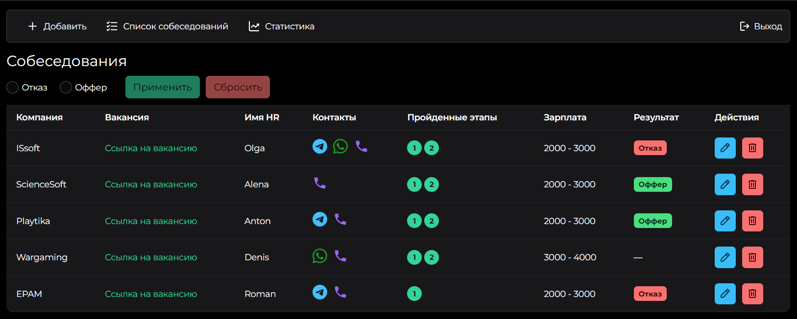

<h1 align="center">List of vacancies</h1>

<div align="center" id="top">
  
</div>
&#xa0;

<p align="center">
  

  

  

  

  
</p>

<p align="center">
  <a href="#dart-about">About</a> &#xa0; | &#xa0;
  <a href="#sparkles-features">Features</a> &#xa0; | &#xa0;
  <a href="#rocket-technologies">Technologies</a> &#xa0; | &#xa0;
  <a href="#white_check_mark-requirements">Requirements</a> &#xa0; | &#xa0;
  <a href="#checkered_flag-starting">Starting</a> &#xa0; | &#xa0;
  <a href="#memo-license">License</a> &#xa0; | &#xa0;
  <a href="https://github.com/matmon12" target="_blank">Author</a>
</p>

<br>

## :dart: About ##


A learning project to gain practical skills in typescript. The project is a simple list of vacancies.

## :sparkles: Features ##

:heavy_check_mark: Adding, deleting and editing vacancies;\
:heavy_check_mark: Filter vacancies by results;\
:heavy_check_mark: Table of vacancies;\
:heavy_check_mark: Authorization;\
:heavy_check_mark: Statistics of vacancies.

## :rocket: Technologies ##

The following tools were used in this project:

- [Vue](https://vuejs.org/)
- [Pinia](https://pinia.vuejs.org/)
- [Vite](https://vitejs.dev/)
- [PrimeVue](https://primevue.org/)
- [TypeScript](https://www.typescriptlang.org/)
- [Vue-router](https://router.vuejs.org/)
- [Chart.js](https://www.chartjs.org/)
- [Firebase](https://firebase.google.com/)
- [Uuid](https://www.npmjs.com/package/uuid)

## :white_check_mark: Requirements ##

Before starting :checkered_flag:, you need to have [Git](https://git-scm.com) and [Node](https://nodejs.org/en/) installed.

## :checkered_flag: Starting ##

```bash
# Clone this project
$ git clone https://github.com/matmon12/ts-learn.git

# Access
$ cd ts-learn

# Install dependencies
$ npm install

# Run the project
$ npm run dev

# Compiles and minifies for production
$ npm run build
```

### Vue 3 + Vite

This template should help get you started developing with Vue 3 in Vite. The template uses Vue 3 `<script setup>` SFCs, check out the [script setup docs](https://v3.vuejs.org/api/sfc-script-setup.html#sfc-script-setup) to learn more.

### Recommended IDE Setup

- [VS Code](https://code.visualstudio.com/) + [Vue](https://marketplace.visualstudio.com/items?itemName=Vue.volar) (and disable Vetur)

## :memo: License ##

This project is under license from MIT. For more details, see the [LICENSE](LICENSE.md) file.


Made with :heart: by <a href="https://github.com/matmon12" target="_blank">Matmon</a>

&#xa0;

<a href="#top">Back to top</a>
